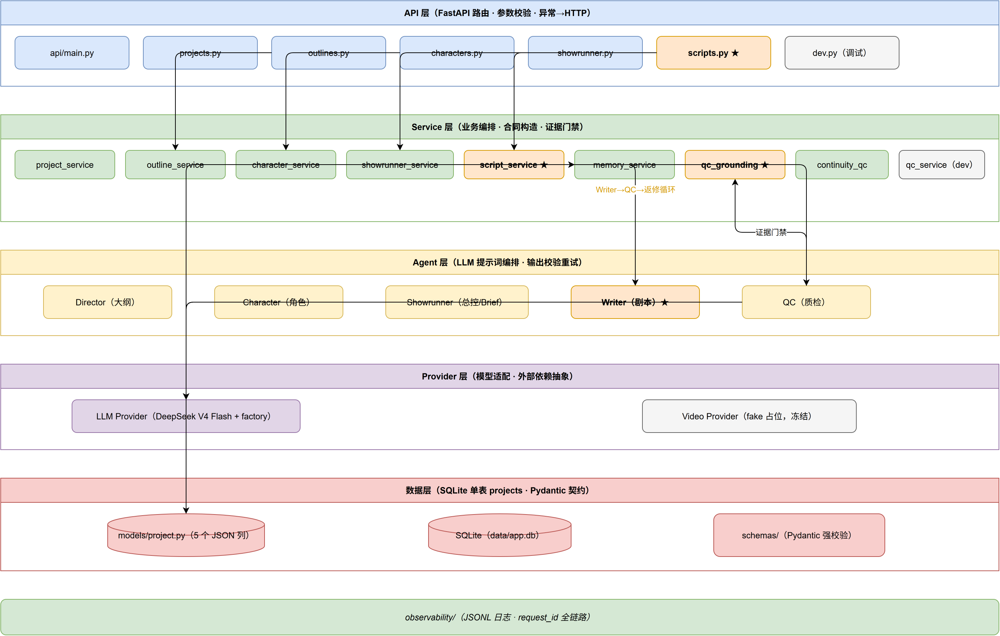

# AI Short Drama Agent（AI 短剧智能生成系统）

一句话：**你给一句故事创意，系统自动生成一部完整的 10 集短剧剧本** —— 从大纲、角色设定到每一集的逐场对白，并且自带"质检流水线"保证前后剧情自洽、伏笔兑现、人物认知不矛盾。

## 核心亮点（面试时值得讲）

- **LLM 不可靠 → 工程约束**：AI 写剧本会"飘"（忘了伏笔、人物前后矛盾）。本项目用**确定性证据门禁**（`qc_grounding.py`）逐字核对 AI 质检报告里的每条证据，杜绝"AI 检查 AI"空转。
- **记忆链控制成本**：每集生成只带上一集的压缩记忆（几百 token），不重读全部历史 —— 做到 20 集也不会越做越贵。
- **义务到期机制**：跨集"坑"（continuity obligations）有来源链和到期日，欠账超过 2 集强制解决，不会无限累积压垮模型。
- **教科书式分层**：API → Service → Agent → Provider → 数据库，换模型只改一个文件。

## 架构总览

```
用户（一句话创意）
    ↓ HTTP
API 层   —— FastAPI 路由：参数校验、异常→HTTP 状态码
    ↓
Service 层 —— 业务编排：合同构造、QC 合并、记忆落库、返修循环
    ↓
Agent 层  —— LLM 提示词编排：Director/Character/Showrunner/Writer/QC
    ↓
Provider 层 —— 模型适配：DeepSeek（OpenAI 兼容）封装，唯一"打电话给 LLM"的地方
    ↓
数据层   —— SQLite 单表 projects（5 个 JSON 列）+ Pydantic 契约强校验

横切：observability/ —— JSONL 结构化日志，request_id 贯穿全链路
```



更直观的说明见 [docs/PROJECT_MAP.md](docs/PROJECT_MAP.md)（5 分钟快速地图）与 [docs/04_operation/ARCHITECTURE_AUDIT.md](docs/04_operation/ARCHITECTURE_AUDIT.md)（深度审计）。

## 生成流程（核心）

```
创意 → 大纲(Director) → 角色圣经(Character) → Showrunner State → 
逐集循环（10 集）：
  Writer Brief（本集任务书 + 连续性合同）
  → Writer 写剧本 → 规则型 QC（纯代码）→ AI QC（LLM 质检）
  → 证据门禁（逐字核对）→ 不过则带修正指令重写（≤2 次）
  → 通过则落库 + 生成该集剧情记忆（供下一集参考）
```

## 快速开始

### 环境要求

- Python 3.12+
- 一个 DeepSeek API key（[platform.deepseek.com](https://platform.deepseek.com)）

### 安装与启动

```bash
# 1. 克隆并进入
git clone https://github.com/czczccc/AI_Short_Drama_Agent.git
cd AI_Short_Drama_Agent

# 2. 创建虚拟环境并安装依赖
python -m venv .venv
.venv/Scripts/activate          # Windows
# source .venv/bin/activate     # macOS / Linux
pip install -r requirements.txt

# 3. 配置环境变量
cp .env.example .env
# 编辑 .env，填入 DEEPSEEK_API_KEY

# 4. 启动服务
.venv/Scripts/python -m uvicorn app.api.main:app --port 8000
```

### 一键生成整季（推荐演示方式）

```bash
# 另开一个终端（服务保持运行）
.venv/Scripts/python tools/generate_season.py \
  --idea "一个程序员被公司陷害后逆袭创业" \
  --name "我的第一部短剧"
```

脚本会自动完成：创建项目 → 大纲 → 角色圣经 → Showrunner State → 逐集生成 10 集（含自动重试与失败报告）。全部完成后项目状态为 `script_ready`。

### 手动分步演示

浏览器打开 Swagger UI：<http://127.0.0.1:8000/docs>，按顺序调用：

| 步骤 | 接口 | 说明 |
|---|---|---|
| 1 | `POST /api/v1/projects` | 创建项目 |
| 2 | `POST /api/v1/projects/{id}/outline` | 生成大纲（body 传 `idea`） |
| 3 | `POST /api/v1/projects/{id}/characters/generate` | 生成角色圣经 |
| 4 | `POST /api/v1/projects/{id}/showrunner` | 生成总控规划（可选） |
| 5 | `POST /api/v1/projects/{id}/episodes/{n}/writer-brief` | 生成第 n 集任务书 |
| 6 | `POST /api/v1/projects/{id}/episodes/{n}/script` | 生成第 n 集剧本（QC 校验+返修） |

请求示例（第 6 步核心接口）：

```json
POST /api/v1/projects/1/episodes/1/script
{
  "use_showrunner_brief": true,
  "run_showrunner_qc": true,
  "max_revision_attempts": 2
}
```

完整 API 契约见 [docs/01_architecture/API.md](docs/01_architecture/API.md)。

### 运行测试

```bash
.venv/Scripts/python -m pytest -q
# 195 passed
```

## 项目结构

```
app/
├── api/          # FastAPI 路由（projects/outlines/characters/showrunner/scripts/dev）
├── services/     # 业务编排（script_service 主循环、qc_grounding 证据门禁、memory_service 记忆链…）
├── agents/       # LLM Agent（director/character/showrunner/writer/qc）
├── providers/    # LLM 抽象（DeepSeek + factory）；video 占位
├── schemas/      # Pydantic 契约（LLM 输出强校验）
├── models/       # ORM（单表 projects）
├── database/     # SQLite 连接与会话
├── configs/      # pydantic-settings 配置
├── observability/ # JSONL 结构化日志
└── prompts/      # 各 Agent 系统提示词
tools/
├── generate_season.py   # 一键整季生成工具
└── text_eval_runner.py  # 评测驱动器（离线工具）
docs/              # 架构/API/数据模型/工作流文档
tests/             # 195 个测试
```

## 成本说明

- 模型：DeepSeek V4 Flash（`deepseek-v4-flash`），文本模型单价很低
- 完整 10 集生成 ≈ 500~700 万 token，约 7~9 元人民币（含重试）
- 单集成本是常量：重生成某一集只花那一集的钱，不会重刷历史

## License

MIT
